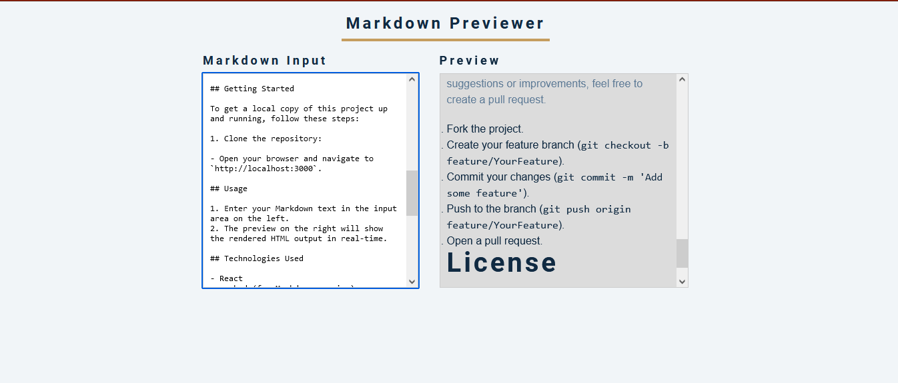

# Markdown Previewer

Markdown Previewer is a simple React app that allows you to input Markdown text and preview the rendered HTML output in real-time.

## Table of Contents

- [Demo](#demo)
- [Features](#features)
- [Getting Started](#getting-started)
- [Usage](#usage)
- [Technologies Used](#technologies-used)
- [Contributing](#contributing)
- [License](#license)

## Demo

Check out the live demo: [Markdown Previewer Demo](https://your-demo-link-here.com)

## Features

- Input area to write Markdown text.
- Real-time preview of the rendered HTML.

## Getting Started

To get a local copy of this project up and running, follow these steps:

1. Clone the repository:

- Open your browser and navigate to `http://localhost:3000`.

## Usage

1. Enter your Markdown text in the input area on the left.
2. The preview on the right will show the rendered HTML output in real-time.

## Technologies Used

- React
- marked (for Markdown parsing)
- CSS for styling

## Contributing

Contributions are welcome! If you have any suggestions or improvements, feel free to create a pull request.

1. Fork the project.
2. Create your feature branch (`git checkout -b feature/YourFeature`).
3. Commit your changes (`git commit -m 'Add some feature'`).
4. Push to the branch (`git push origin feature/YourFeature`).
5. Open a pull request.

## License

This project is licensed under the MIT License - see the [LICENSE](LICENSE) file for details.
